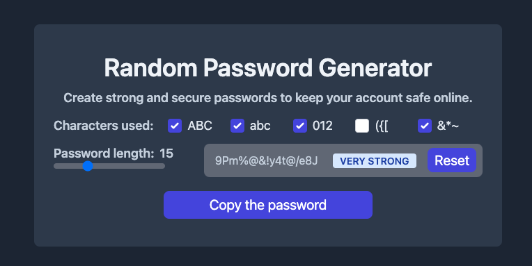

# 🔐 Password generator 

### Description

An application that allows passwords to be generated.
The user can customise which password to generate.
For this task it can choose which characters to use to generate the password.
List of available characters:

- uppercase letters [A, B, C, etc]
- lowercase letters [a, b, c, etc]
- numbers [1, 2, 3, etc]
- symbols ["!", "?", "@", "#", "$", "%", "&"]
- brackets ["(", ")", "[", "]", "{", "}"]

You can also set the length of the password, the minimum length is one character, the maximum length is fifty characters.

<!--  -->
