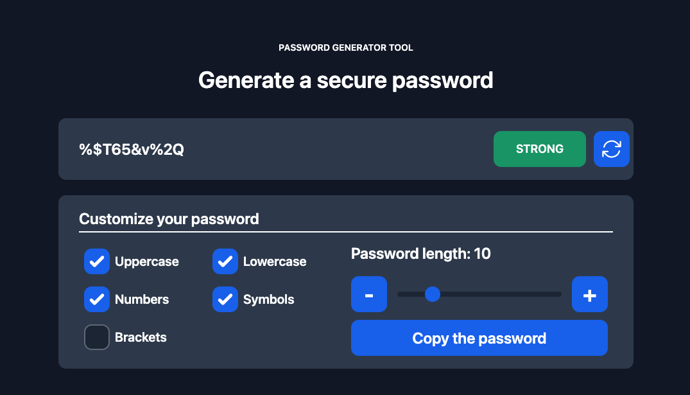

# 🔐 Password generator 

### Technology Stack

- TypeScript
- React
- Redux Toolkit
- Tailwind CSS
- React Spring

### Description

An application for generating strong and secure passwords.  
The user can customise which password to generate.  
For this task it can choose which characters to use to generate the password.  
List of available characters:

| Сategory          | Сharacters                          |
| ----------------- | ----------------------------------- |
| uppercase letters | [A, B, C, etc]                      |
| lowercase letters | [a, b, c, etc]                      |
| numbers           | [0, 1, 2, etc]                      |
| symbols           | ["!", "?", "@", "#", "$", "%", "&"] |
| brackets          | ["(", ")", "[", "]", "{", "}"]      |

The user can also set the length of the password, with a minimum of one character and a maximum of fifty characters.

